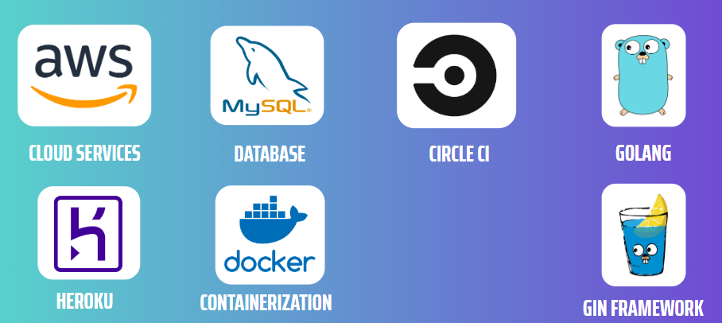
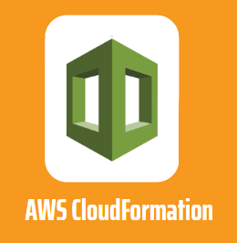
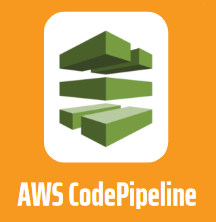
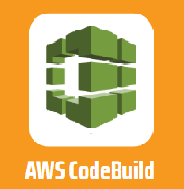
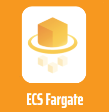
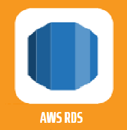
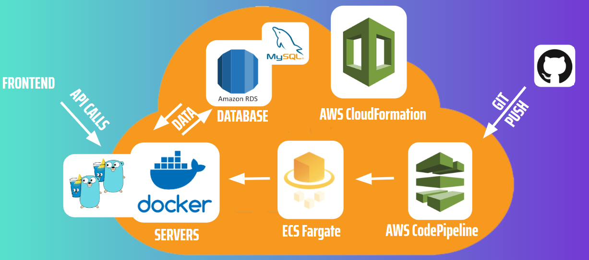
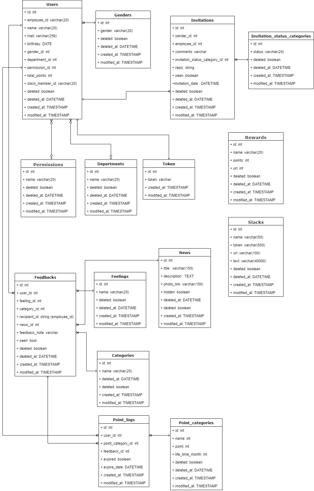

## About the app 
#
<h1 align="center"> </h1> 

[](https://circleci.com/gh/project-symi/backend-symi/tree/master) 


Symi is a gamified platform for promoting positive feedback and company morale. Employees get points for sending anonymous feedback directly to their CEO. CEO's can have a top-level overview of company sentiment in the form of data visualization personalized to company changes to employees.


## Additional Info
This is the backend server implementation for SYMI.

To test out the working version or learn more about the front end, please check out the demo link above or see the frontend [Readme](https://github.com/project-symi/frontend-symi). 
### ✨ [Demo](https://www.symi.dev)

## Technology



## Running the backend server

### *Docker*


SYMI backend makes use of Docker to create and image of the app and be able to deploy a docker container quickly and with easy

```sh
docker build -t symi-backend
//symi-backend can be replaced with your desired image name
```

```sh
docker run --rm -it -p 5000:8080 -e PORT=8080 symiback-end
```
`-p 5000` -> determines which port your container will be accessible on<br>
`:8080` -> which port the app is listening on (inside the container).<br>
By default the app listening port is 8080, however it can be changed by passing in a PORT environment variable (-e PORT=####).

### *Makefile*
If needed, it is possible to utilize Makefile, instead of Docker.
If you have Make installed, you can run the app with  
```sh
make run
```

### *Go*


Directly running the go application is also possible with  
```sh
go run ./application.go
```

## Deploying

Symi-backend contains 2 setups that can be utilized - AWS and Heroku
In both cases, please make sure to add the following Environment variables:

`DB_INFO: the full link to the Database you plan to use for the app <user>:<password>@tcp(<link_to_db>)/<db_name>`<br>
`SIGNING_KEY: <string> - will be used as SALT to hash and check your passwords for storage.`

Make sure to run migrations (and seed some data) from `/app/migrations` and `/app/seeder`.

### *Heroku*


To deploy the backend server Heroku, create an app via the CLI or on [Heroku](https://heroku.com).
Fork your version of the backend-SYMI repository.
Link your created app with the forked github repository.
Click "Deploy" in settings!

Based on Heroku.yml, a docker image will be created. Heroku will then start up a container in your app.

### *AWS*


AWS Deployment will require some prior setup.
The first step will be to create the initial CI/CD Pipeline that will be building the Docker image and deploying the rest of the infrastructure.
This step has to be performed manually.

Either via the AWS CLI tool, or using the [AWS Cloudformation website](https://aws.amazon.com/cloudformation/), create a new stack using the ready template.
Template: `/cloudformation/codepipeline.yml`

* Please make sure to add a Personal Access Token to your account allowing AWS CFN access to the repository.
* Change the current template info GithubUserName/GithubRepo/GithubBranch to match your fork.

Once the template is created, With every push to the branch that was specified in GithubBranch, the AWS Codepipeline will build the Docker image, store it into an S3 bucket, and finally trigger the infrastructure build using ECS Fargate.

Once again, by default Fargate will create 2 tasks running in 2 different Subnets and create a loadbalancer that connects them both.
To get access to the server, plese find the DNS adress in the ECS Instances -> ElasticLoadBalancers.

### AWS Workflow







The main steps of the deployment process are as follows:

1. User manually deploys the initial Cloudformation template containing the CodePipeline infrastructure (`CodePipeline.yml`).
2. Cloudformation starts the deployment of the AWS CodePipeline infrastructure.
3. After the Cloudformation deployment, CodePipeline pulls the source code from Github in the source stage.
4. CodePipeline builds the docker image and pushes to the ECR in the build stage using AWS CodeBuild service.
5. CodePipeline starts the deployment of the Cloudformation template (`Fargate-Cluster.yml`) containing Fargate ECS Cluster in the deploy stage.

Simplified structure can be seen below:



For more details details and information, please check out the following article: [AWS Cloudformation Managed (Medium.com)](https://medium.com/swlh/aws-cloudformation-managed-complete-ecs-infrastructure-including-ci-cd-pipeline-from-github-to-ecs-b833bb44e01c)

## Infrastructure

For this project we implemented a clean architecture ([Onion Architecture](https://www.thinktocode.com/2018/08/21/onion-architecture-skeleton-example/)).

## Database Structure

To match the complex data flow of SYMI information, the below structure was created.



Furthermore, due to the potentially large amount of user actions, instead of using [ORM](https://en.wikipedia.org/wiki/Object-relational_mapping) for DB interactions, the read/write operations are done using pure SQL, to achieve faster handling speed.

## Future Features

* Utilize Go routines and/or channels to further speed up data handling.

* Breakdown the monolith code into microservices (employee actions would be loaded more than CEO, so scaling only that part would be easier).

* Create functionality to support the future features mentioned on the frontend Readme:
  * Custom Assignments
  * Employee Slack Notifications
  * Ivite Calendar Integration
  * Points Animations
  * Badges & Rewards


## Contributors
<table>
 <tr>
    <td align="center">
      <a href="https://github.com/miniengineer">
        <br />
        <sub><b>Mini</b></sub>
      </a><br />Tech Lead
    </td>
    <td align="center"><a href="https://github.com/FuyuByakko"><br /><sub><b>Igor</b></sub></a><br />Fullstack</td>
    <td align="center"><a href="https://github.com/steffieharner"><br /><sub><b>Steffie Harner</b></sub></a><br />Design/Frontend</td> 
    <td align="center">
      <a href="https://github.com/Yukio0315"><br />
        <sub>
          <b>Yukio Ueda</b>
        </sub>
      </a><br />
      Backend
    </td>
 </tr>
</table>

## Show your support

Give a ⭐️ if you like our stuff!

## 📝 License

This project is [ISC](https://github.com/project-symi/frontend-symi/license.md) licensed.
